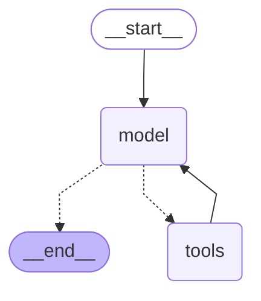

# Session 2: агент как граф LangGraph

## Граф



`MessagesState` → узел `model` (`bind_tools` + system prompt) → `tools_condition` → `ToolNode` → обратно в `model`. Текстовый протокол Thought/Action и `parse_action` из session-01 удалены: модель вызывает инструменты через tool calling провайдера.

Три зависимых инструмента с префиксом `spec_course_`: `spec_course_find` возвращает id курсов, `spec_course_info` и `spec_course_enroll` принимают этот id.

## Диалог: четвёртое сообщение ссылается на третье

`uv run python run.py "Are there free seats on the LLM agents course? Enroll me as Sasha if so."`

```
================================ Human Message =================================

Are there free seats on the LLM agents course? Enroll me as Sasha if so.
================================== Ai Message ==================================

I'll look up the course first.
Tool Calls:
  spec_course_find (call_1cbc1588ecc540aaa3dbbf5c)
 Call ID: call_1cbc1588ecc540aaa3dbbf5c
  Args:
    query: agents
================================= Tool Message =================================
Name: spec_course_find

sc-02: LLM Agents
================================== Ai Message ==================================
Tool Calls:
  spec_course_info (call_781b6920e56b49f5b77bffe6)
 Call ID: call_781b6920e56b49f5b77bffe6
  Args:
    course_id: sc-02
================================= Tool Message =================================
Name: spec_course_info

LLM Agents: Friday 16:30, Room 412, teacher I. Smirnov, 25 seats free.
================================== Ai Message ==================================

Yes — 25 seats free. Enrolling you now.
Tool Calls:
  spec_course_enroll (call_bd68a8618b6648f7a0f37ffb)
 Call ID: call_bd68a8618b6648f7a0f37ffb
  Args:
    course_id: sc-02
    student: Sasha
================================= Tool Message =================================
Name: spec_course_enroll

Enrolled Sasha in LLM Agents. 24 seats left.
================================== Ai Message ==================================

Done. You're enrolled in LLM Agents (sc-02) — Friday 16:30, Room 412, taught by I. Smirnov. 24 seats remain.
```

Восемь сообщений: id `sc-02`, который `spec_course_find` вернул в сообщении 3, стал аргументом вызова в сообщении 4 (`spec_course_info`) и в сообщении 6 (`spec_course_enroll`).

## Трейс

Экспорт из локального Langfuse: `runs/session-02-trace.json`. Один трейс `LangGraph`: четыре спана `model` с генерациями `ChatOpenAI`, между ними три спана `tools` с вызовами `spec_course_find`, `spec_course_info`, `spec_course_enroll`.
